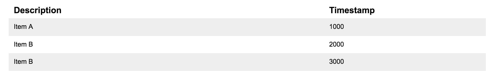

# NG Workshop

## Step 1: Install Angular CLI
```
$ npm install -g @angular/cli
...
$ ng new workshop --skip-git --directory .
```

## Step 2: Using the CLI
```
$ npm run start # ng serve (development server)
...
$ npm run test # ng test (unit tests)
...
$ npm run e2e # ng e2e (e2e tests)
```

Generating code
```
$ npm run ng -- generate service feature/videos/videos # ng generate
...
  create src/app/feature/videos/videos.service.spec.ts
  create src/app/feature/videos/videos.service.ts
  WARNING Service is generated but not provided, it must be provided to be used
...
$ npm run ng -- generate component feature/videos/videos # ng generate
...
  create src/app/feature/videos/videos/videos.component.css
  create src/app/feature/videos/videos/videos.component.html
  create src/app/feature/videos/videos/videos.component.spec.ts
  create src/app/feature/videos/videos/videos.component.ts
  update src/app/app.module.ts
...
```

For more information visit the [Angular CLI Wiki](https://github.com/angular/angular-cli/wiki)

## Step 3: Building our first component

For our first example we will build a list component. The component will list
our items containing a description and timestamp in milliseconds. We will refer
to this as the `log-list` component.



### Creating our first component

We will start by defining our `log-list` component.

``` typescript
// src/app/components/log-list/log-list.component.ts
import { Component } from "@angular/core";

@Component({
    selector: `ws-log-list`,
    template: `<h1>Log list component</h1>`
})
export class LogListComponent {

}
```

Let's try using this component in our app component. Replace the content of the
app component template.

``` html
// src/app/app.component.html
<ws-log-list></ws-log-list>
```

Open the app and we will see the following error:

```
Unhandled Promise rejection: Template parse errors:
'ws-log-list' is not a known element:
```

Defining our component was not enough to start using it in our application. We
will have to register it in our application module.

``` typescript
// src/app/app.module.ts
...
    import { AppComponent } from './app.component';
[+] import { LogListComponent } from './components/log-list/log-list.component';

    @NgModule({
    declarations: [
        AppComponent,
[+]     LogListComponent
    ],
...
```

Great! We should now see `Log list component` when opening the application in 
our browser. Now let's create a more dynamic component.

### Component input

Before we extend our component with inputs, we will first define what this input
will look like. Our input for the component will be a list (array) of log items.

``` typescript
// src/app/components/log-list/log-item.interface.ts
export interface LogItem {
    description: string;
    timestamp: number;
}
```

We can now use the `@Input` decorator to define an input on our component and
update the template to display our items.

> You can install the angular2-inline plugin for VSCode for proper highlighting.

``` typescript
// src/app/components/log-list/log-list.component.ts
import { Component, Input } from '@angular/core';
import { LogItem } from './log-item.interface';

@Component({
    selector: `ws-log-list`,
    styles: [`
        .log-list_header,
        .log-list_item {
            display: flex;
        }
        
        .log-list_header {
            font-weight: bold;
        }
        
        .log-list_description {
            flex-grow: 1;
        }
        
        .log-list_timestamp {
            width: 200px;
        }
        
        .log-list_item:nth-child(odd) {
            background: #dadada;
        } 
    `],
    template: `
        <div class="log-list">
            <div class="log-list_header">
                <div class="log-list_description">Description</div>
                <div class="log-list_timestamp">Timestamp</div>
            </div>
            <div class="log-list_item" *ngFor="let logItem of logItems">
                <div class="log-list_description">{{logItem.description}}</div> 
                <div class="log-list_timestamp">{{logItem.timestamp}}</div> 
            </div>
        </div>
    `
})
export class LogListComponent {

    @Input() logItems: LogItem[];
}
```

The @Input decorator will allow us to provide the logItems from the parent
component.

``` html
// src/app/app.component.html
<ws-log-list [logItems]="logItems"></ws-log-list>
```

``` typescript
import { Component } from '@angular/core';
import { LogItem } from "./components/log-list/log-item.interface";

@Component({
    selector: 'app-root',
    templateUrl: './app.component.html',
    styleUrls: ['./app.component.css']
})
export class AppComponent {
    logItems: LogItem[] = [{
        description: 'Log item 1',
        timestamp: 1000
    }, {
        description: 'Log item 2',
        timestamp: 2000
    }];
}
```

We should now see the list of log items displayed in the browser. On to the
next lesson!
